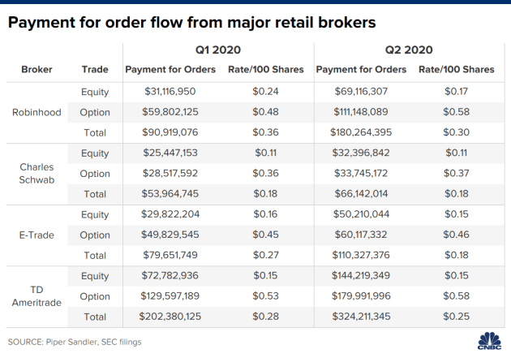
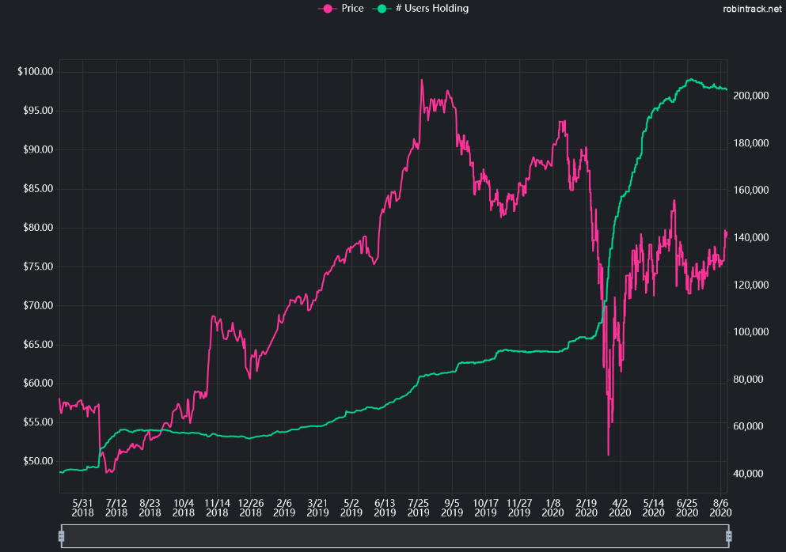

# Robinhood Inc Case Study: A Wolf in Sheep’s Clothing
[Overview](##overview-and-origin)

[Business Activities](##business_activities)

[Landscape](##landscape)

[Results](##results)

[Recommendations](##recommendations)

[Final Words](##final_words)

## Overview and Origin
Founded in 2013 by Vladimir Tenev and Baiju Bhatt, Robinhood is an American financial services company based in Menlo Park, Ca.  As ex-High Frequency Trading (HFT) platform builders, Bhatt and Tenev saw that traditional brokers charged fees of $5-10 per trade that only cost them pennies, as well as requiring sizeable account minimums of $500 to $5000.  The company’s mission was thus born: to “provide everyone with access to financial markets, not just the wealthy.” After 75 investor pitches, the founders finally found a few willing venture capitalists.  Concurrent with the website and service launch, Robinhood had closed its seed round of about $3 million, led by Index, Google Ventures, Marc Andreessen.  Robinhood still continues to raise capital, most recently its Series G on August 8, 2020 funded another $200 million from investment firm D1 Capital Partners at a valuation of $11.2 billion.  Robinhood is one of the hottest fintech startups in Silicon Valley, having consistently raised large sums at higher valuations from several marquee investors including Sequoia Capital, Ribbit Capital and Index Ventures. According to PitchBook and Reuters calculations, it has raised about $1.71 billion so far.

## Business Activities:
Robinhood was designed to bring commission free trading to the public, to “democratize investing for all".  Additionally, Robinhood provides easy to understand and aesthetically pleasing free web/mobile app trading platforms, no account minimums, as well as a basic investing guide.  Fractional share investing, easy to understand options, ETF and cryptocurrency access are all part of the package.  The Gold paid membership includes Morningstar research report access, faster access to deposits and other perks.

The scope of Robinhood customers is not necessarily directed at anyone in particular aside from just the wealthy who traditionally have access to more sophisticated wealth management and trading funds.  Growing a customer base can be difficult, even with the lure of free trades and while the power of referrals is not new, Robinhoood brilliantly offered an initial incentive: refer a friend and get bumped up in the original waiting list.  2014 opened the waitlist and Robinhood has consistently drawn users since. 
### Robinhood referral program growth 
 

 Robinhood has been overwhelmingly adopted by the Millennial demographic, comprising 80% of their 3 million accounts in 2018.  Likely due to the Covid-19 pandemic, 3 million customers joined Robinhood as record retail trading and new customer accounts opened in 2020 for all brokerage firms.  Robinhood now holds over 13 million accounts as trading returns to the public limelight. 

Arguably, with its simple UI, lack of technical indicators and inability to write algorithms or short stocks, Robinhood is geared towards novice investors or very specific investors using outside resources, keeping Robinhood as an execution platform.  After analyzing the competition, Robinhood actually does not offer any completely unique service anymore except for combining an equity, option and cryptocurrency trading in one platform.  However, unless 2 commission-free brokers are an issue for the user, this can be easily overcome.  Their advantage is in the simplicity of user interface and their brand popularity which is well received by many customers.  

### Robinhood vs competitor UI

In October 2019, the newsfeed system was rebuilt to retrieve RSS feeds from Faust, the Python based stream processing library, providing "timely news delivery, scalable content ingestion pipeline and storage to accommodate different media types and upgraded infrastructure to support personalized content." Given the amount of big data Robinhood contends with, they've created a buffer with Kafka, so that content is aggregated from a RSS/partner feed-> Fetch->Parse->Process->End user process and stored by the open source search and analytics engine, Elasticsearch.  Delivered feeds are then ranked by machine learning (ML) models for personalization efforts, currently based on users positions and watchlists.  APIs then deliver the feed to a client and are updated regularly.  

What really makes Robinhood successful is their combination of pleasing customers in this regard while having developed a comprehensive backend technology suite that profits off an investor that either does not need the absolute best orderflow processing or doesn’t know the difference.  Clearing is the system built in-house by Robinhood for its transaction clearing mechanism, directly integrated with critical parts of the trading industry. Python 3, Django, Kafka, Airflow, React JS and Redux were all part of designing this highly automated clearing and settlement system. Workflow management, analytics and metrics aggregation as well as "certain brokerage operations" is directed by Airflow in Python, which at the start of 2019 was improved due to performance and reliability issues.  Most of Wall Street is not highly automated, rather, largely centralized and often uses outdated systems while Robinhood designed a backend infrastructure that may make them a major player in the trading world for years to come.   

## Landscape:
The personal finance industry that Robinhood is a part of comprises a number of different subsectors.  Wealth management from Fintech companies like Wealthfront and Betterment provide clients with easy access to roboadvisors and a suite of AI driven investment advice and goals.  Mint has led the Fintech revolution in personal finance budgets and financial management.  As a part of the financial service subsector Robinhood joins one of America’s oldest and entrenched institutions, Wall Street.    
Fintech has brought about innovations that have seen broad industry acceptance even within Wall Street legacy brokerage firms: trading account debit cards, savings account management with automatic ETF reinvestment, as well as roboadvising and more advanced trading platforms.  While Robinhood has not led the charge in these categories, many of their competitors have found an audience by specializing in one or two features.  Many skeptics doubted the ability of Robinhood to maintain market share once industry commissions went to zero, but the industry seems to operate in a roundabout, follow-the-leader fashion as competitors drop commissions, and Robinhood introduces extra features like debit cards.  In the end, Robinhood still remains one of the smaller disruptors in the online broker space at approximately $20 billion due to smaller average account sizes.  
 
With quick adoption rates, Robinhood has a competitor at every major retail brokerage firm like Charles Schwab, Ameritrade, and E-trade, but also a slew of other similar Fintech cousin companies that have zero fees and additional features.  The largest social network for finance, Stocktwits, recently announced it too would offer a commission free trading service; M1 Finance offers a new hybrid robo/self-directed approach as well as the ability to borrow at low interest rates; WeBull is a virtual Robinhood clone but offers advanced trading platform and IRA accounts.  Even bank/brokers like Merrill Edge of Bank of America offer commission free trading and a host of benefits for $50,000-$100,000 accounts.                   

## Results
Publicly, by far the one thing Robinhood accomplished has been the complete dismantling of Wall Street commission and fee structures that have been the hallmark of traditional brokerages for centuries.  Only 30 years ago the cost of a stock trade was around $45 round trip.  By removing barriers of entry, investing has become more accessible but not necessarily easier: investing continues to be just as much an art as a science. Interestingly, high commission costs traditionally drove interlinked pieces of Wall Street business, helping to fund research departments or shore up proprietary trading department losses.  U.S. asset managers are unbundling fees, charging separately for research and commissions, thus shrinking the research sector overall.  

While Robinhood seems to be a crowd-pleasing disruptor, it still generates profits despite no commission and fee revenue.  Like many of its competitors, it has a paid membership feature in Robinhood Gold, interest earnings from customer cash, stocks and margin accounts.  Behind the scenes, profits are also generated by orderflow rebates from market makers.  In effect, Robinhood makes the majority of their revenue from routing trades through “behind-the-scenes” parties like the High Frequency Trading (HTF) firms Citadel or Two Sigma, receiving rebate payments in return.  Key metrics therefore revolve largely around the number of users, their account sizes, turnover or “churn” rate, and account type.  Traders that transact frequently and at market instead of with a limit order create more opportunities for Robhinhood’s clearing house to receive generous rebates.  However, this is not any different from every other discount broker and is in fact a core piece of this industry’s business as these market maker relationships bring trade execution speed and quality optimization.  

### Orderflow Payments of Major Brokers

Arguably, the advent of HTFs, orderflow rebates and 24/7 market liquidity is the industry’s organic response to the slow loss of commission and fee income.  The question simply becomes if the broker is treating its customers fairly, which in 2019 Robinhood was fined for failing to get its customers the best prices.  Still, Robinhood roughly doubled customer trade rebate revenue in Q2 2020, it attracts the highest rebate rate of 17 cents per 100 shares of any firm for equity trades and saw the greatest quarter over quarter increase in payment for order flow of any e-broker according to recent SEC regulatory filings.  Options trading has by far been the most lucrative for Robinhood in 2020, generating $170 million in order flow payments with equity 50% of that. Options are not as liquid as equities and have wider bid-ask spreads, especially with complex option strategies involving multiple transactions.  Robinhoood also offers commission free options trading which is alluring to traders as most brokers like E-Trade and TDameritrade still charge a flat fee and per contract fee under certain transaction minimums.   While Robinhood may be one visually appealing, low-feature platform relative to competitors, it is an industry profit leader because of their market maker rebate relationship coupled with its attractive UI experience.  

### HFT Payment Comparison

In short, Robinhood braved the way for an entirely new generation of investors to access the market and 10 years later the number of firms that charge more than $5 per transaction are far less than those that charge $0, but at what questionable cost to their access to fair prices?  News and social media have written extensively about the rebate practices and client complaints are starting to catch up with Robinhood’s practices as the cat has come out of the bag.  Complaints range from app outages, not being able to close accounts, reach a customer service agent, or sell holdings and access features during high volatility.  
### Rising Complaints in 2020
 

Tragically, in June 2020 a young trader took his life when he saw a negative balance of over $700,000 that "may not have represented uncollateralized indebtedness at all, but rather his temporary balance until the stocks underlying his assigned options actually setteled into his account".  A different glitch in Robinhood Gold's deposit leverage code allowed traders in 2019 to add the value of sold call options to users' buying power.  One trader took a $3000 deposit and turned it into a $1.7 million AMD position as the call value of the options sold incorrectly increased the user's cash balance with no ceiling when performing this loop. Robinhood fixed this bug in November 2019.

In short, providing a clean UI, no transaction costs and a profitable backend orderflow process has pushed Robinhood into 2020's most profitable personal investing companies but there have been setbacks, bugs and negative social costs.  A profitable clearing house is not necessarily a new invention, but one that is almost entirely automated, data and algo driven and keeps customers relatively happy is an enviable model for competitors to copy.  

## Recommendations
Robinhood clients interestingly still seem to be drawn to the current UI platform despite its simplicity relative to other platforms and the recent surfacing of suspect rebate practices.  Similar to Snapchat and Instagram in terms of navigation, the Millennial generation appreciates this UI comfort.  In the image below the amount of white space Robinhood strategically uses improves reading comprehension, clearing away excess information that users don’t need.  User experience is at the forefront of Robinhood’s engineering values.  

Giving the kids the keys to the toolshed in this case seems to be a disadvantage for Robinhood’s competitors, however, as Robinhood’s users mature and become more seasoned investors, they will naturally look to shore up their losses, improve their profit taking strategies, received better customer (live or bot) support, and not continue to read that their chosen clearing house is a hidden profit monster.  Unless Robinhood also desires the next generation of novice traders to merely substitute for their current user base, they will have to grow with Millennials by offering a more sophisticated platform featuring more advanced technical indicators, custom tailored economic and research reports, and roboadvisors.  They will need to have better customer service, perhaps by developing a Python bot that can handle 80-90% of customer issues and then maintain a small live agent work force for emergency and special cases.  Lastly given the surge of new clients and growing spotlight on Robinhood’s orderflow routing, a revamping of the rebate relationship is a must.  Make the rebates collected smaller and execution better in return for increased transaction volume from larger accounts. 

Offering updated interface options that hold true to the original design heritage would allow Robinhood to have a multi-pronged model to capture both new or novice traders while maintaining clients that have now been with Robinhood for 10+ years and desire a more comprehensive suite of indicators, automated execution, research and news feed access.
“RobinhoodTrader” and “RobinhoodWealth” would be two new domains that Robinhood could develop to capture their expanding client demographic.  Both new services, to compensate for increased orderflow transparency, could require either a greater account balance or transaction volume minimums if they were offered as a free account, otherwise like Robinhood Gold, the premium collected would help to offset the loss.  Finally, offering exposure to Decentralized Finance (DeFi) apps could find big inroads with current and potential clients.

### RobinTrader
A “RobinTrader” API could be utilized by professional grade 3rd party software would be an interesting route to take if certain issues around orderflow routing are cleared up as mentioned above.  Given the nature of high frequency trading commission costs, market and technological accessibility, a rerelease of the Robinhood API could open a new field of quantitative trading. For those willing to do the work, usually through a combination of github, selenium or python the unofficial Robinhood API can currently be accessed.  
Adding more technical indicators and studies will have to be written in Python and APIs will have to be setup to retrieve relevant economic research data, preferably tied to the user’s newsfeed and stock picking preferences.  Currently Robinhood only offers Morningstar research reports to Gold members but are not tailored to a user’s watchlists and stock picking trends like the newsfeed delivery.  
A separate UI for experienced investors wouldn’t require much in terms of completely changing the current platform’s technology because it currently can produce slightly different charts, simple indicators and newsfeeds.  Robinhood’s data architecture utilizes a scalable data lake system capable of supporting petabytes of data so these would be simple additions to existing infrastructure, effectively cloning and adding to the current UI.  What will be key is not having the GUI get too “busy” as the white space experience should remain.  
Given the Millennial’s social media tint, creating a metric similar to Robintract’s price/popularity trends would be a welcome addition to both the “novice” and “advanced” interface designs.  As the API source code is available on github, the inhouse team at Robinhood wouldn’t have any issues cloning this as an indicator or even teaming with Robintrack officially.  

Fees and commissions reduce portfolio value even as a winning strategy compounds over years and obviously is detrimental to any higher frequency trading strategy. While Robinhood doesn’t advocate any particular strategy, "RobinTrader" would provide a better platform to research and implement previously cost prohibitive strategies for short term intraday strategies up to long term multiproduct rebalancing, hedging or index tracking strategies.

### RobinWealth
Built off the "RobinTrader" concept, "RobinWealth" would utilize that infrastructre to build a comprehensive offering of different roboadvisors.  Studies show that wealthy Millenials as well as consumers with at least 500k in investable assets are the highest users of roboadvisors.  As Robinhood’s original client base matures and grows their wealth, Robinhood should develop an interface that matches their needs.  Roboadvisor algorithms that utilize artificial intelligence (AI) and machine learning (ML) to track investor behavior, user provided bank account information, and risk preferences coupled with tax harvesting, rebalancing, and sector index tracking processes could provide inroads for Robinhood to get users out of just being traders and thinking about trading as an integral part of wealth management.  Utilizing API’s for direct integration to client’s secondary bank accounts or finTech payment accounts like Paypal or Venmo would allow Robinhood to develop RobinhoodWealth into a comprehensive wealth management service for their maturing Millennial clients.  
            
### DeFi   
Both “Robintrader” and “Robinwealth”, and even standard Robinhood, could expand into the area of Defi with a trader’s platform and roboadvisor model for “Robinwealth” clients.  Not only would this be a further step in the Robinhood ethos to decentralize finance, as alternative assets, Defi applications (Dapps) offer peer-to-peer cryptocurrency services well beyond Robinhood's current Bitcoin and other supported cryptos trading access.  There are Dapps designed for a variety of interesting traditional financial services that can offer exposure to different risk frontiers like borrowing/lending cryptocurrencies to earn interest with the platforms Compound or Aave; event trading with Augur; transacting in stablecoins that are pegged to a currency or commodity; or create and exchange derivates of real-world assets like precious metals on Synthetix. Expanding to this area of the crypto world would require some degree of oversight by Robinhood as this is a relatively new arena, yet critically it has the potential to expand Robinhood’s clientbase even more as all that is needed is a smartphone and internet connection. Studies show that 66% of people without a bank account have a smartphone while 40% of the global population is without any form of banking at all and likely these people would fall into Robinhood’s novice target audience.  Tapping into this market with the updated platforms would require Dapp API’s, a due diligence study of the open source code and smart contracts of the Dapp offered, and Roboadvior AI/ML studies on how the Dapp risk exposure would affect the portfolio for “RobinWealth” clients.     

## Final Words
The amazing part about Robinhood is that by automating most of the backend of traditional brokerage firms, developing profitable ways of directing and processing customer order flow, and until recently, staying out of the way of users, they’ve effectively become a highly profitable distruptor in the industry without the public completely realizing that Wall Street’s “Greed is Good” motto still very much exists.  Ultimately, if Robinhood wants to go public and thrive for years to come, it must redevelop the “Wolf in Sheep’s clothing” ethos they've unwittingly adopted.  Competitive brokerage firms are offering too many of the same perks Robinhood currently has and there may be a time when clients begin to leave en mass if negative publicity and FTC complaints countinue to mount.  By providing better customer service, developing concepts like “Robintrader” and “Robinwealth”, and improving their orderflow rebate process, then, Robinhood may be able to expand their client base effectively allowing their clearing house process to refine and enhance revenue streams provided by traders, Roboadvisors and relevant DeFi Dapp exposure.  

## Sources

https://www.businessinsider.com/robinhood-app-vlad-tenev-founder-free-stock-trading-valuation-2017-7

https://www.reuters.com/article/us-robinhood-funding/robinhood-valuation-surges-to-112-billion-after-latest-funding-round-idUSKCN25D207

https://markets.businessinsider.com/news/stocks/robinhood-closes-200-million-series-g-funding-round-valuation-billions-2020-8-1029509874

https://www.bizjournals.com/boston/blog/techflash/2015/11/boston-fintech-startup-forms-major-partnership.html

https://www.sec.gov/investor/alerts/ib_fees_expenses.pdf

https://robinhood.com/us/en/support/articles/our-mission/

https://www.cnbc.com/2020/08/13/how-robinhood-makes-money-on-customer-trades-despite-making-it-free.html

https://faust.readthedocs.io/en/latest/

https://robinhood.engineering/under-the-hood-of-clearing-by-robinhood-3ed7ab09d60

https://robinhood.engineering/from-news-to-newsfeed-7fe80732b961

https://www.nbcnews.com/tech/tech-news/confetti-push-notifications-stock-app-robinhood-nudges-investors-toward-risk-n1053071

https://www.financemagnates.com/forex/brokers/robinhood-tops-13-million-users-raises-280m-at-8-3b-valuation/

https://www.fool.com/the-ascent/research/online-brokerage-statistics/

https://www.marketwatch.com/story/stocktwits-to-launch-commission-free-stock-trading-platform-to-rival-robinhood-others-2019-04-18

https://bullishbears.com/robinhood-competitors/

https://www.brokerage-review.com/better-compare/competitors/robinhood-vs-competition.aspx

https://www.kiplinger.com/article/investing/t052-c007-s001-commission-free-trades-a-bad-deal-for-investors.html

https://www.businessinsider.com/historical-trading-commissions-2014-3

https://www.bloomberg.com/news/articles/2019-12-19/analyst-jobs-vanish-as-a-perfect-storm-hits-wall-street-research

https://www.inc.com/jim-schleckser/why-transparency-might-kill-goldman-sachs.html

https://robinhood.com/us/en/support/articles/how-robinhood-makes-money/

https://hedgetrade.com/how-does-robinhood-make-money/

https://www.thestreet.com/investing/how-does-robinhood-make-money-14856528

https://seekingalpha.com/article/4212397-robinhood-high-frequency-trading-scandal-plot-thickens

https://www.investopedia.com/articles/active-trading/020515/how-robinhood-makes-money.asp#citation-21

https://www.cnbc.com/2020/08/13/how-robinhood-makes-money-on-customer-trades-despite-making-it-free.html

https://www.thinkadvisor.com/2020/08/31/robinhoods-dark-side-irate-traders-u-s-probe/

https://www.forbes.com/sites/sergeiklebnikov/2020/06/17/20-year-old-robinhood-customer-dies-by-suicide-after-seeing-a-730000-negative-balance/#46556a6c1638

https://markets.businessinsider.com/news/stocks/robinhood-infinite-leverage-bug-copycat-trader-builds-huge-position-millions-2019-11-1028666004

https://markets.businessinsider.com/news/stocks/robinhood-fixes-infinite-leverage-free-money-glitch-suspends-related-traders-2019-11-1028670689

https://markets.businessinsider.com/news/stocks/robinhood-fixes-infinite-leverage-free-money-glitch-suspends-related-traders-2019-11-1028670689

https://www.cbinsights.com/research/personal-finance-apps-strategies/

https://medium.com/@jameslee_54071/payment-for-order-flow-robinhood-589fabcfbaa7

https://www.financial-planning.com/news/who-actually-uses-robo-advisors-new-data-reveals-surprising-answers

https://www.securities.io/what-is-defi/

https://theconversation.com/what-is-defi-and-why-is-it-the-hottest-ticket-in-cryptocurrencies-144883

https://blog.coinbase.com/a-beginners-guide-to-decentralized-finance-defi-574c68ff43c4

https://towardsdatascience.com/step-by-step-building-an-automated-trading-system-in-robinhood-807d6d929cf3

https://github.com/topics/robinhood-api

https://robinhood.engineering/data-lake-at-robinhood-3e9cdf963368

https://robinhood.com/us/en/support/articles/viewing-indicators/

https://robintrack.net/

https://github.com/ameobea/robintrack

https://robinhood.com/us/en/support/articles/professional-research/

https://blog.wealthfront.com/introducing-new-dashboard/

